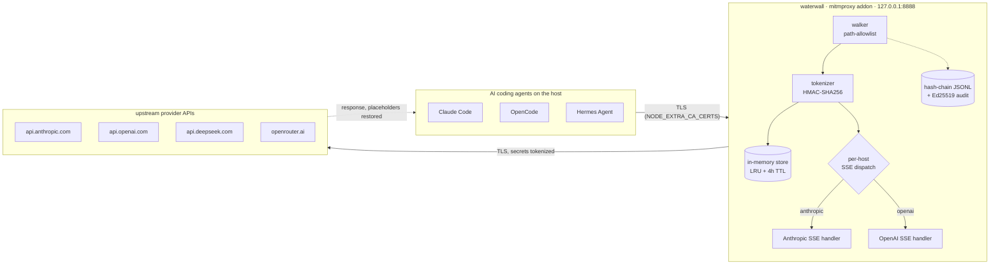
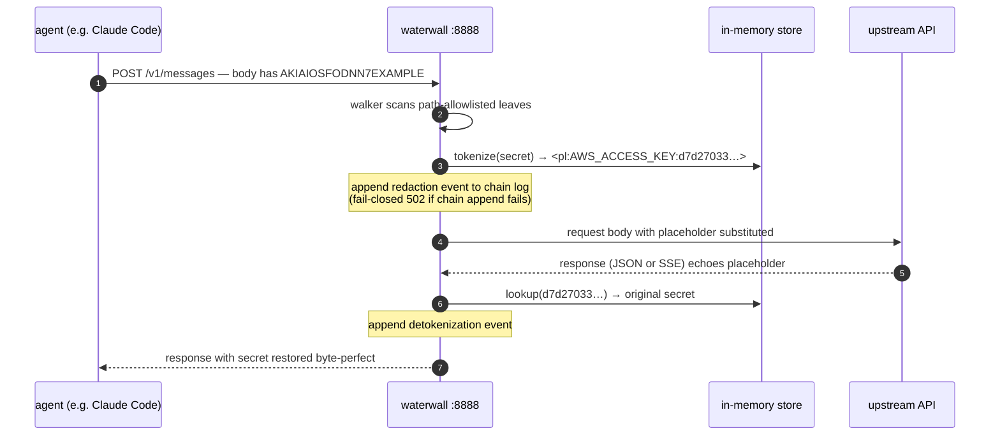
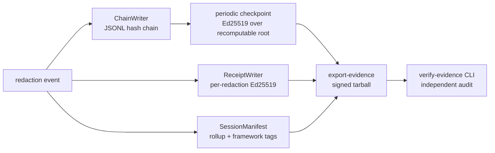
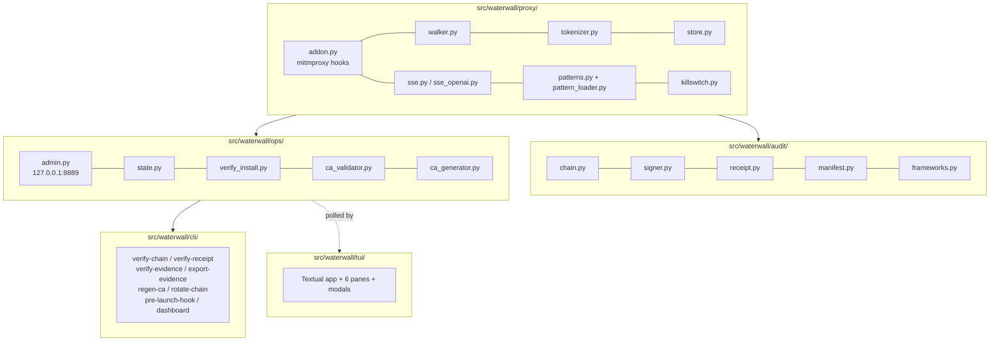

# Waterwall

```
 ██╗    ██╗ █████╗ ████████╗███████╗██████╗ ██╗    ██╗ █████╗ ██╗     ██╗
 ██║    ██║██╔══██╗╚══██╔══╝██╔════╝██╔══██╗██║    ██║██╔══██╗██║     ██║
 ██║ █╗ ██║███████║   ██║   █████╗  ██████╔╝██║ █╗ ██║███████║██║     ██║
 ██║███╗██║██╔══██║   ██║   ██╔══╝  ██╔══██╗██║███╗██║██╔══██║██║     ██║
 ╚███╔███╔╝██║  ██║   ██║   ███████╗██║  ██║╚███╔███╔╝██║  ██║███████╗███████╗
  ╚══╝╚══╝ ╚═╝  ╚═╝   ╚═╝   ╚══════╝╚═╝  ╚═╝ ╚══╝╚══╝ ╚═╝  ╚═╝╚══════╝╚══════╝
       reversible-tokenization egress proxy · single-operator homelab
```

Reversible-tokenization egress proxy for AI coding agents. Single-operator homelab.

**Status:** Deployed in production on the operator's IAM control-node (`prod-host`, Debian 13 LXC). v1 (Claude-Code-only) live since 2026-05-08; the v2 multi-agent build plus the full Argus-review remediation (issues #6–#17) was cut over on **2026-06-10** — `verify-install --runtime` 10/10, `/healthz` `status: ok`, `patterns_loaded: 30`, `chain_intact: true`.

## What it does

Waterwall is a [mitmproxy](https://mitmproxy.org) addon that intercepts the HTTPS API traffic of AI coding agents and performs **reversible tokenization**: on egress, secret-shaped strings are replaced by deterministic HMAC-SHA256 placeholders `<pl:TYPE:HMAC8>`; on ingress (including streaming SSE), the placeholders are restored byte-for-byte. The upstream provider never sees plaintext secrets.

v2 covers **four upstream hosts** out of the box and is operator-extensible to more without code changes:

| Upstream host | Reached by | SSE handler |
|---|---|---|
| `api.anthropic.com` | Claude Code, OpenCode (Anthropic route) | `anthropic` |
| `api.openai.com` | Codex-style clients, OpenCode (OpenAI route) | `openai` |
| `api.deepseek.com` | Hermes Agent (DeepSeek-backed) | `openai` |
| `openrouter.ai` | OpenCode (OpenRouter route) | `openai` |

The host list lives in `/etc/waterwall/permitted_hosts.yaml`; add a `{host, sse_handler}` entry, run `waterwall regen-ca`, restart, and a new provider is covered.



**30 patterns** match the operator's working credential surface (29 single-line formats + one multi-line PEM block; live count via `/healthz`):

- AI vendors: Anthropic (key + OAuth), OpenAI, Google AI, OpenRouter, Groq, Perplexity
- Cloud / infra: AWS, Cloudflare, GitHub, Vercel, Supabase, Turso, Dropbox
- Identity tokens: Atlassian, HuggingFace, JWT
- Communication: Discord, Telegram, SendGrid, Twilio (SID + key)
- Productivity: Notion, Linear, ClickUp, Jina, ElevenLabs, Brave Search
- Multi-line PEM blocks (OpenSSH / RSA / EC / DSA / PGP private keys)

Features beyond the redaction core:

- **Tamper-evident audit log** (Flight Recorder): hash-chained JSONL with Ed25519-signed checkpoints. `verify-chain` recomputes each checkpoint root from the line's own content, so a replayed signature on a forged chain fails (Argus #6). The chain **resumes `seq`/`prev_hash` across proxy restarts** (Argus #8) — restarts no longer break verification.
- **Action receipts** for every redaction, independently verifiable
- **Session manifests** with behavioral fingerprints (redactions/request, unknown-placeholder counts)
- **Compliance framework tags** on every chain line (SOC 2, OWASP-LLM, EU AI Act, MITRE ATLAS)
- **Signed evidence bundles**: `export-evidence` produces a tarball whose MANIFEST is itself Ed25519-signed and whose chain stats + receipt↔chain references are cross-checked by `verify-evidence` (Argus #12)
- **Four-source kill switch** (config, SIGUSR1, sentinel file, HTTP API) — OR-composed, fail-closed
- **Hot-reload** of patterns and config without dropping connections; a successful reload swaps the live scan set and emits a `policy_change` chain event (Argus #10)
- **Fail-closed config gating**: a missing/corrupt `permitted_hosts.yaml` 502s every request rather than silently forwarding plaintext (Argus #7)
- **SessionStart pre-launch hook** for Claude Code that warns when the proxy is unhealthy or kill-switched
- **Cyberpunk Textual TUI** for live operational visibility (`waterwall dashboard`)

## How it works

Round-trip — what the wire actually carries when a request body holds a secret:



Placeholders are `<pl:TYPE:HMAC8>` where HMAC8 is the first 16 hex chars of `HMAC-SHA256(session_key, plaintext)` — deterministic within a process so the same secret always maps to the same placeholder, but unguessable without the per-process session key.

Audit pipeline — every redaction emits independently verifiable artifacts:



Compliance framework tags are attached per chain `line_type` (`src/waterwall/audit/frameworks.py`). For example a `redaction` line carries `SOC2-CC7.2`, `SOC2-CC9.2`, `OWASP-LLM-02`, `OWASP-LLM-06`, `EU-AI-Act-Art-12`, `EU-AI-Act-Art-13`, `MITRE-ATLAS-T0048`; a `killswitch` line carries `SOC2-CC7.3`, `EU-AI-Act-Art-15`. The tags surface in the session manifest and the evidence bundle.

## Architecture at a glance



## Installation (Debian 13 LXC, primary target)

```bash
# /opt is root-owned on Debian — clone and build the venv as root (sudo).
sudo git clone https://github.com/jimstratus/waterwall.git /opt/waterwall
cd /opt/waterwall
sudo python3 -m venv .venv && sudo .venv/bin/pip install -e ".[dev]"
sudo ./deploy/systemd/install.sh   # creates waterwall user, seeds permitted_hosts.yaml,
                                    # generates 4-host CA + Ed25519 signing key, installs the service
sudo systemctl start waterwall-proxy
```

The install script is idempotent: re-running won't clobber an existing CA, signing key, config, or permitted-hosts file. Full step-by-step with key-backup and validation gates: **`docs/deploy.md`**.

## Installation (Windows 11 via NSSM, secondary target)

```powershell
python -m venv .venv
.\.venv\Scripts\python.exe -m pip install -e ".[dev]"
Set-ExecutionPolicy -Scope Process Bypass
.\deploy\nssm\install.ps1
```

The Windows installer adds a `waterwall-proxy` service, auto-downloads NSSM if needed, and stores CA/config/audit material under `C:\ProgramData\Waterwall`. See `deploy/nssm/README.md`.

## Configure a client (Claude Code shown)

> **Log in BEFORE enabling the proxy.** The Name-Constrained CA permits only the
> four configured API hosts — NOT `console.anthropic.com`, which Claude Code's
> OAuth callback uses. `claude /login` with `HTTPS_PROXY` set fails with
> `OAuth error: permitted subtree violation`. Correct order:
>
> ```bash
> unset HTTPS_PROXY NODE_EXTRA_CA_CERTS CLAUDE_CODE_CERT_STORE
> claude /login                          # direct to Anthropic, no proxy
> claude --print "ping" | head -3        # confirm token works
> # Then enable the proxy for session traffic:
> export HTTPS_PROXY=http://127.0.0.1:8888
> export NODE_EXTRA_CA_CERTS=/etc/waterwall/ca.pem
> export CLAUDE_CODE_CERT_STORE=bundled,system
> ```
>
> The cached OAuth token persists in `~/.claude/`; you only re-login when it
> expires (which again requires un-setting the proxy first).

Once authenticated:

```bash
export HTTPS_PROXY=http://127.0.0.1:8888
export NODE_EXTRA_CA_CERTS=/etc/waterwall/ca.pem
export CLAUDE_CODE_CERT_STORE=bundled,system

# Exclude non-API hosts the client touches for updates/telemetry — the
# Name-Constrained CA refuses to MITM these by design, so they must bypass
# the proxy or the TLS handshake fails.
export NO_PROXY="127.0.0.1,localhost,downloads.claude.ai,statsig.anthropic.com,http-intake.logs.us5.datadoghq.com"
```

Add the pre-launch hook to `~/.claude/settings.json`:

```json
{
  "hooks": {
    "SessionStart": [
      { "matcher": "*", "hooks": [{ "type": "command", "command": "/opt/waterwall/.venv/bin/waterwall pre-launch-hook" }] }
    ]
  }
}
```

The hook reads `/healthz` and, when the proxy is offline or the kill switch is engaged, emits a SessionStart `additionalContext` warning (`hookSpecificOutput` form) and exits 1. Note SessionStart hooks **cannot hard-block** a session — enforcement that actually refuses to launch lives in the `deploy/wrappers/waterwall-launch` wrapper, which gates on that exit code (Argus #17).

### Windows client guidance

For Windows workstations, use the helpers in `deploy/windows/`:

- `install_tunnel_task.ps1` — Task Scheduler tunnel at logon
- `install_claude_hook.ps1` — appends the SessionStart hook without clobbering existing hooks
- `waterwall-sessionstart.ps1` — the PowerShell pre-launch shim

Point the Windows tunnel at a **dedicated Waterwall proxy host** rather than `prod-host` so Windows-client traffic doesn't mix with the control-node's audit chain. See `deploy/windows/README.md`.

## Run the TUI

```bash
waterwall dashboard
# always-on in tmux (create-or-attach, respawns on quit):
./deploy/waterwall-tui
```

Cyberpunk theme — Matrix-green for healthy, magenta-red blink for alarms. Six panes:
LIVE ACTIVITY · COUNTERS (5-min) · KILL SWITCH (4-source) · MAP / PATTERNS · CHAIN / AUDIT · ACTIVE SESSIONS.
The TUI is a read-only renderer polling `127.0.0.1:8889/admin/state` at 1 Hz; it must run on the proxy host. Footer keys: `[r]` reload patterns, `[k]` killswitch, `[v]` verify-install, `[e]` export-evidence, `[t]` toggle tail, `[q]` quit.

## CLI reference

> The `waterwall` command is the venv console script — the installer does **not**
> put it on `PATH`, and `sudo` uses a restricted `secure_path` that excludes the
> venv, so bare `sudo waterwall …` fails on a fresh host. It's installed at
> `/opt/waterwall/.venv/bin/waterwall` with a shim at `/opt/waterwall/bin/waterwall`.
> The clean one-time fix (puts it on PATH for your user **and** root's `secure_path`):
>
> ```bash
> sudo ln -s /opt/waterwall/.venv/bin/waterwall /usr/local/bin/waterwall
> ```
>
> After that, the bare `waterwall` / `sudo waterwall` commands below run verbatim.
> Without it, substitute the full shim path `/opt/waterwall/bin/waterwall`.

```bash
waterwall verify-install [--runtime]     # 10 health checks (startup binds ports; runtime reads /admin/state)
waterwall verify-chain   <log> --pubkey <pub>     # prev_hash continuity + recomputed checkpoint signatures
waterwall verify-receipt <file> --pubkey <pub>    # single Ed25519 action receipt
waterwall export-evidence --chain <log> --policy <patterns.py> \
    --pubkey <pub> --signing-key <key> -o <out.tar.gz> \
    [--receipts-dir D] [--manifests-dir D] [--since YYYY-MM-DD] [--until YYYY-MM-DD]
waterwall verify-evidence <bundle.tar.gz> --pubkey <pub>   # full bundle audit (signed MANIFEST + cross-checks)
waterwall regen-ca [--hosts-file permitted_hosts.yaml] [--out-dir /etc/waterwall]   # 4-host RSA-4096 CA
waterwall rotate-chain [--chain-path <log>]      # archive current chain, start fresh (proxy must be stopped)
waterwall pre-launch-hook                        # SessionStart health gate (used by the launch wrapper)
waterwall dashboard                              # TUI
```

`export-evidence` now **requires** `--signing-key` (the MANIFEST is signed) — older two-arg invocations no longer parse.

## Verify a running deployment

These read protected paths — `/var/log/waterwall` is `0750` and `signing.key`
is `0400 root` — so run them as **root** (or as a member of the `waterwall`
group for the log-only commands). With the `/usr/local/bin` symlink above,
`sudo waterwall` works; otherwise use `sudo /opt/waterwall/bin/waterwall`.

```bash
sudo waterwall verify-install --runtime
sudo waterwall verify-chain    /var/log/waterwall/proxy.jsonl --pubkey /etc/waterwall/signing.pub
sudo waterwall export-evidence --chain /var/log/waterwall/proxy.jsonl --policy /etc/waterwall/patterns.py \
    --pubkey /etc/waterwall/signing.pub --signing-key /etc/waterwall/signing.key -o /tmp/evidence.tar.gz
sudo waterwall verify-evidence /tmp/evidence.tar.gz --pubkey /etc/waterwall/signing.pub
```

## Documents

- **Deployment guide:** `docs/deploy.md`
- **Operational runbook:** `docs/runbook.md`
- **Threat model:** `docs/threat-model.md`
- **v1 design contract:** `docs/superpowers/specs/2026-05-05-waterwall-design.md`
- **v2 multi-agent design:** `docs/superpowers/specs/2026-05-09-waterwall-v2-multi-agent-design.md`
- **Argus review + remediation:** `docs/superpowers/reviews/2026-06-10-argus-multi-model-review.md`, `docs/superpowers/plans/2026-06-10-argus-remediation.md`
- **Backlog:** `BACKLOG.md`

## License

MIT.
