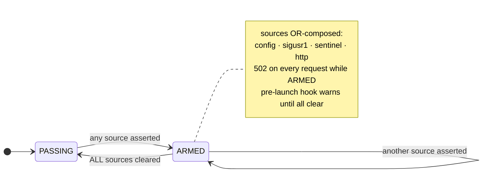

# Waterwall operational runbook

Day-to-day operations, diagnostics, and recovery for the Waterwall proxy on the production `prod-host` IAM control-node. Reflects the v2 multi-host build post-Argus-remediation (deployed 2026-06-10).

Ports: proxy `127.0.0.1:8888`, admin/healthz `127.0.0.1:8889`. Service: `waterwall-proxy.service` (User `waterwall`).

> **`waterwall` CLI on PATH:** the command is the venv console script and is **not** on `PATH` by default; `sudo` also uses a restricted `secure_path` that excludes the venv, so bare `sudo waterwall …` fails on a fresh host. It lives at `/opt/waterwall/.venv/bin/waterwall` (shim `/opt/waterwall/bin/waterwall`). The clean one-time fix — works for your user **and** `sudo` (`/usr/local/bin` is on `secure_path`):
>
> ```bash
> sudo ln -s /opt/waterwall/.venv/bin/waterwall /usr/local/bin/waterwall
> ```
>
> After that, the bare `waterwall` / `sudo waterwall` commands below run verbatim. Without it, substitute the full shim path `/opt/waterwall/bin/waterwall`. Commands that touch `/etc/waterwall/signing.key` (0400 root) or `/var/log/waterwall` (0750) need root.

## 1. Day-to-day operations

### Kill switch — four OR-composed sources

Any one engaged → fail-closed (HTTP 502 on every request). The check runs *before* the host gate, so an armed switch blocks every intercepted flow.



**Arm** — pick the source that matches your scenario:

| Source | How | Persistence |
|---|---|---|
| **config.yaml** | `echo 'kill_switch: true' \| sudo tee /etc/waterwall/config.yaml` | Persists across restart |
| **SIGUSR1** | `sudo kill -USR1 $(pidof waterwall-proxy)` | In-memory latch; resets on restart (toggle) |
| **Sentinel file** | `sudo touch /run/waterwall/kill` | Survives restarts (`RuntimeDirectoryPreserve=restart`); cleared on host reboot or service stop |
| **HTTP API** | `curl -X POST localhost:8889/admin/killswitch -d '{"action":"arm","reason":"..."}'` | In-memory; persists until HTTP disarm or restart |

> The sentinel now survives a service restart (Argus #15 — it used to be wiped by `RuntimeDirectory` cleanup on every restart, including the weekly timer). It is still cleared on a full host reboot (tmpfs) or `systemctl stop`.

**Disarm — disarming one source does NOT clear the others.** The switch is OR-composed; if you armed via SIGUSR1 and disarm via HTTP, the HTTP flag clears but the SIGUSR1 latch stays set → still active. The TUI killswitch modal surfaces this (and now checks the HTTP source itself before claiming success, Argus #15). Clear each asserted source:

- **config:** `echo 'kill_switch: false' | sudo tee /etc/waterwall/config.yaml`
- **sigusr1:** `sudo kill -USR1 $(pidof waterwall-proxy)` (toggles the latch off)
- **sentinel:** `sudo rm /run/waterwall/kill`
- **http:** `curl -X POST localhost:8889/admin/killswitch -d '{"action":"disarm"}'`

Verify: `curl -s localhost:8889/admin/state | jq '.killswitch'` — all four flags `false`, `active: false`.

### Hot-reload patterns

Edit `/etc/waterwall/patterns.py` (the `PATTERNS = [(label, regex), ...]` extension list, appended to the built-in set). The PatternLoader picks it up via inotify within ~1 s. A **successful** reload swaps the live scan set, refreshes the policy hash, and writes a `policy_change` chain line (Argus #10 — the reload used to be a no-op that still reported success). Verify:

```bash
curl -s localhost:8889/admin/state | jq '.patterns.last_reload_ts, .patterns.hash'
```

On parse / regex-compile failure the loader logs `[pattern_loader] reload refused: ...` to journald and **keeps the existing set**. Triggering a reload over the admin API surfaces that failure as HTTP 500 (not a false 200):

```bash
curl -i -X POST localhost:8889/admin/reload     # 200 {"status":"reloaded"} or 500 {"error":"..."}
```

### Restart the proxy

```bash
sudo systemctl restart waterwall-proxy.service
```

Restart drops in-flight connections; clients reconnect on the next request. The chain log **resumes** `seq`/`prev_hash` from the last line on restart (Argus #8) — no genesis fork, no false tamper alarm, no manual rotate needed. (If the tail is torn — a half-written final line — the writer refuses to start with `ChainAppendError: unparseable chain line N`; run `verify-chain`, then `rotate-chain`.)

### Trigger the preventive restart manually

```bash
sudo systemctl start waterwall-proxy-restart.service
```

The weekly timer (`waterwall-proxy-restart.timer`, Sun 03:00 ±10 min) calls this oneshot to recycle mitmproxy memory. Run it manually after a heavy session if you want.

### Rotate the chain log (manual)

Only needed for a clean break (major-version cutover) or to recover from a torn tail — restarts no longer require it. The proxy must be stopped (a live `.lock` with a live PID makes `rotate-chain` refuse; a stale lock from a SIGKILLed proxy is detected and cleared, Argus #8):

```bash
sudo systemctl stop waterwall-proxy
sudo /opt/waterwall/bin/waterwall rotate-chain --chain-path /var/log/waterwall/proxy.jsonl
sudo systemctl start waterwall-proxy
```

The old log is archived (`proxy.jsonl.vN-archived-<ts>`) with a properly-chained terminal `rotation` entry, so the archive still passes `verify-chain`.

### Add / change a permitted host

```bash
sudoedit /etc/waterwall/permitted_hosts.yaml      # add {host, sse_handler: anthropic|openai|none}
sudo /opt/waterwall/bin/waterwall regen-ca         # 4096-bit CA, permittedSubtrees = new yaml set
# re-import /etc/waterwall/ca.pem on any client that pins NODE_EXTRA_CA_CERTS
sudo systemctl restart waterwall-proxy
```

`regen-ca` generates into a temp dir and swaps only on success, backing up the old CA as `*.bak-<ts>` — a failed regen leaves the live CA intact. The unit's `--allow-hosts` regex must also include the new host; update `deploy/systemd/waterwall-proxy.service` and `daemon-reload` if you add a host the regex doesn't cover.

## 2. Diagnostics

### TUI shows the OFFLINE banner

```bash
waterwall verify-install --runtime
curl -sf localhost:8889/healthz | jq
sudo systemctl status waterwall-proxy
sudo journalctl -u waterwall-proxy -n 100
```

`/healthz` returns 503 only when `status != "ok"`, and `status` is gated by three things: signer key readable, pattern count ≥ 16, and `chain_intact` (`StateAggregator.snapshot()`). `upstream_reachable` is **reported** in the body but does **not** gate `status`/503 — it stays `false` until the proxy relays its first upstream response, so a freshly-started healthy proxy legitimately shows `200` with `upstream_reachable: false` until traffic flows. Read the body fields to see which gating probe failed. Unit `failed` = see `journalctl` for the `ExecStartPre` (verify-install) failure or the `ExecStart` (mitmdump) crash. The TUI never shows stale data; recovery is automatic on the next successful 1 Hz poll.

### Client stalls 5–10 min after arming the kill switch

**Expected** Claude SDK behavior, not a Waterwall bug. The proxy returns 502 immediately, but the SDK treats 5xx as retryable and backs off exponentially before surfacing:

```
API Error: 502 {"error":"waterwall-killswitch-engaged","sources_active":["http"]}
```

Confirm the proxy responds immediately by bypassing the SDK retry loop:

```bash
curl -x http://127.0.0.1:8888 -X POST https://api.anthropic.com/v1/messages \
  -H "x-api-key: test" -H "anthropic-version: 2023-06-01" -H "content-type: application/json" \
  -d '{"model":"claude-3-5-haiku","max_tokens":1,"messages":[{"role":"user","content":"hi"}]}' \
  --cacert /etc/waterwall/ca.pem -w "\nHTTP %{http_code}\n"
```

Returns immediately with the engaged error and HTTP 502.

### Which kill-switch sources are active

```bash
curl -sf localhost:8889/admin/state | jq '.killswitch'
```

While engaged, every request to a permitted host returns 502 with `sources_active`. Disarm per section 1.

### Map size at 80%

Expected for long sessions. The store (`capacity 10000`, `4h TTL`) evicts via LRU once full. Investigate only if it repeatedly hits 100% — a leak (placeholders never detokenized in responses) or secrets cycling faster than TTL. Check `counters_5m.unknown_placeholders`; non-zero means the LRU/TTL path is firing.

### Unknown-placeholder warnings

Chain lines with `unknown_placeholders > 0` mean a response carried a `<pl:TYPE:HMAC8>` whose mapping is no longer in the store; v1 passes these through unchanged (intentional). Remedy: restart the client session to clear orphaned placeholders.

### Chain won't verify after a restart

With the #8 resume fix this should not happen for a clean restart. If it does, the tail was likely torn (power loss mid-write). `waterwall verify-chain` reports the first bad seq; `rotate-chain` archives the damaged log and starts fresh. The archived log remains independently verifiable up to the break.

## 3. Audit operations

### Verify a single receipt

```bash
waterwall verify-receipt /var/log/waterwall/receipts/<file>.json --pubkey /etc/waterwall/signing.pub
```

`{"ok": true, ...}`, exit 0/1.

### Verify the chain log

```bash
waterwall verify-chain /var/log/waterwall/proxy.jsonl --pubkey /etc/waterwall/signing.pub
```

Walks every line, checks `prev_hash` continuity, and for each `checkpoint` **recomputes the root from the line's own zeroed-field content** before verifying its Ed25519 signature (Argus #6). Reports `OK: N lines verified, M checkpoints valid` or `FAIL: first failure at seq X: <reason>`. An empty log fails (not a vacuous OK).

### Export an evidence bundle

```bash
waterwall export-evidence \
    --chain /var/log/waterwall/proxy.jsonl \
    --receipts-dir /var/log/waterwall/receipts \
    --manifests-dir /var/log/waterwall/manifests \
    --policy /etc/waterwall/patterns.py \
    --pubkey /etc/waterwall/signing.pub \
    --signing-key /etc/waterwall/signing.key \
    --out /tmp/evidence.tar.gz
```

`--signing-key` is **required** — the bundle MANIFEST is Ed25519-signed. The chain is snapshotted before hashing so a concurrent live append can't make the fresh bundle fail its own verification (Argus #12). Optional `--since/--until YYYY-MM-DD` filter receipts/manifests by filename-timestamp prefix; the chain is always included in full.

### Verify an evidence bundle

```bash
waterwall verify-evidence /tmp/evidence.tar.gz --pubkey /etc/waterwall/signing.pub
```

Checks, in order: per-file SHA-256 integrity → **MANIFEST Ed25519 signature** → chain crypto (prev_hash continuity + recomputed checkpoint signatures) → **MANIFEST chain-stats cross-check** (lines / checkpoints / seq-range vs the actual verify result) → per-receipt Ed25519 → **receipt `chain_seq` cross-reference** to a real redaction line → per-session-manifest Ed25519 → bundled-pubkey identity match. Any failure short-circuits with `failure_reason`. The bolded steps are the Argus #12 additions that make selective omission / truncation detectable.

### Reading the chain log

Each line is canonical JSON. Useful jq:

```bash
jq -c 'select(.line_type=="redaction") | {seq, host, redactions}' /var/log/waterwall/proxy.jsonl | head
jq -c 'select(.line_type=="checkpoint") | {seq, ts, chain_root_hash}' /var/log/waterwall/proxy.jsonl
jq -c 'select(.line_type=="policy_change") | {seq, old_policy_hash, new_policy_hash}' /var/log/waterwall/proxy.jsonl
jq -rc 'select(.host) | .host' /var/log/waterwall/proxy.jsonl | sort | uniq -c   # per-host attribution
```

## 4. Backup

| Artifact | Location | Policy |
|---|---|---|
| **Signing key** | `/etc/waterwall/signing.key` (0440 root:waterwall) | Out-of-band. **Lost = all historical chain unverifiable forever.** Treat like a CA root. |
| **Public key** | `/etc/waterwall/signing.pub` | Distribute to verifiers. Safe to share. |
| **CA cert + key** | `/etc/waterwall/ca.{pem,key}` | Out-of-band; needed to re-issue clients' `NODE_EXTRA_CA_CERTS`. |
| **Permitted hosts** | `/etc/waterwall/permitted_hosts.yaml` | Back up with the CA — the CA's `permittedSubtrees` must match it. |
| **Chain log** | `/var/log/waterwall/proxy.jsonl` | logrotate; ~14-day retention. |
| **Receipts/manifests** | `/var/log/waterwall/{receipts,manifests}/` | Same retention; each file independently verifiable. |

## 5. Upgrades

- **Client (e.g. Claude Code):** pin a version. Before upgrading, re-run the Phase 0/1 lab checks (TLS-gate spike + Name-Constrained CA validation) to confirm the new client still respects `NODE_EXTRA_CA_CERTS`.
- **mitmproxy:** pin to 12.2.2. Before upgrading, verify `--set confdir=...` still resolves the CA the same way (Phase 1 lab established this for 12.2.2).
- **Patterns:** hot-reloadable via `/etc/waterwall/patterns.py`. No restart.
- **Adding a provider host:** edit `permitted_hosts.yaml` → `regen-ca` → update the unit's `--allow-hosts` regex → restart. See section 1.
- **Everything else:** `sudo systemctl restart waterwall-proxy`.

## 6. Pattern set updates

When a new credential format appears:

1. Add the regex to `/etc/waterwall/patterns.py` as `(LABEL, regex)`.
2. Confirm hot-reload: `curl -s localhost:8889/admin/state | jq '.patterns.last_reload_ts'` advances; a `policy_change` line appears in the chain.
3. Drive a synthetic secret through the proxy; confirm a redaction line for the new label.
4. **Always test new patterns against the synthetic-secret corpus first** to avoid production false positives.

## 7. TUI operations

### Keymap

| Key | Action |
|---|---|
| `[r]` | Reload patterns (POST `/admin/reload`; surfaces a 500 on refusal) |
| `[k]` | Killswitch arm/disarm modal |
| `[v]` | `verify-install --runtime` |
| `[e]` | Export evidence bundle (date-range pickers; now passes all required flags incl. `--signing-key`) |
| `[t]` | Toggle live-activity tail |
| `[q]` | Quit |

Launch always-on in tmux: `/opt/waterwall/deploy/waterwall-tui` (create-or-attach; `--kill`/`--status`). The TUI polls `127.0.0.1:8889/admin/state` on a worker thread (Argus #16 — the poll no longer blocks the UI), so a slow admin endpoint won't freeze it.

### Partial-disarm scenario

Arm via SIGUSR1, then `[k] disarm` clears only the HTTP source; the modal warns which sources remain. Run `kill -USR1 $(pidof waterwall-proxy)` again to toggle the SIGUSR1 latch off. Full matrix in section 1.

### Pane status

- `●UP` (green) — proxy healthy, accepting traffic
- `●FAIL` (red blink) — `/healthz` 503; check signer key, pattern count, upstream, chain
- `●ACTIVE` (kill-switch pane) — at least one source asserted
- `●OFFLINE` — admin endpoint unreachable; all panels go red (no stale data)

### Theme

Requires 24-bit color (any modern terminal). Confirmed: Windows Terminal, tmux on Linux, xterm with `TERM=xterm-256color`.
