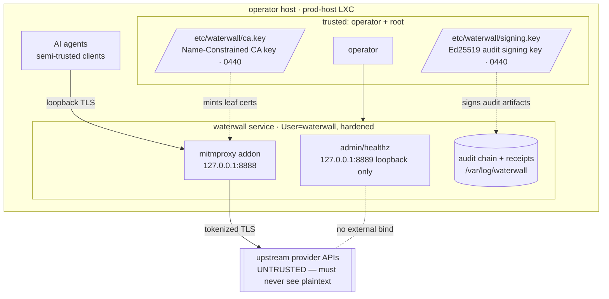

# Waterwall threat model snapshot

Distilled from spec §18 (v1) and the v2 multi-agent design. **Single-operator homelab scope.** Multi-tenant SaaS deployment is out of scope and not addressed by this design — calibrate every "risk" below to a single trusted operator on a LAN, not a hostile-tenant service.

This snapshot reflects the **post-Argus-remediation** state (issues #6–#17, deployed 2026-06-10). Where a fix changed a prior limitation, it is called out inline.

## Trust boundaries

The single hard boundary Waterwall enforces is **agent → upstream**: plaintext secrets must not cross it. Everything inside the host is "semi-trusted" under the single-operator model; the audit layer makes operator-side tampering *evident*, not *impossible*.

## In scope: threats and mitigations

| Threat | Mitigation | Component |
|---|---|---|
| **Plaintext credential leaving the host** | All scanned request bodies walk a JSON path-allowlist; secret-shaped strings are replaced with `<pl:TYPE:HMAC8>` deterministic placeholders before forwarding upstream. Covers all four permitted hosts via per-host SSE handler dispatch. | `proxy/walker.py`, `patterns.py`, `proxy/sse*.py` |
| **Config error silently disabling redaction** | A missing or unparseable `permitted_hosts.yaml` is fail-closed: every request returns HTTP 502 instead of forwarding plaintext, and the kill-switch check runs *before* the host gate (Argus #7). | `proxy/addon.py` (`request`, `running`) |
| **Audit log tampering** | Hash-chained JSONL: every line carries `prev_hash = SHA-256(prev canonical line)`. `verify-chain` walks the file and reports the first seq where continuity breaks. The chain **resumes `seq`/`prev_hash` from the last line on restart** (Argus #8), so legitimate restarts no longer look like tampering. | `audit/chain.py`, `cli/verify_chain.py` |
| **Audit log forgery via replayed signature** | Periodic Ed25519-signed checkpoints (every 100 lines or 5 min). `verify-chain` **recomputes the checkpoint root from the line's own zeroed-field content** before checking the signature, so a genuine `(root, signature)` pair replayed onto a fabricated chain fails (Argus #6 — previously the embedded root was trusted at face value). Forging a passing chain now requires the signing key. | `audit/signer.py`, `chain.emit_checkpoint()`, `cli/verify_chain.py` |
| **Evidence bundle tampering / selective omission** | `export-evidence` Ed25519-signs the bundle MANIFEST itself; `verify-evidence` checks that signature, cross-checks the MANIFEST's chain stats (lines / checkpoints / seq-range) against the actual `verify-chain` result, and cross-references every receipt's `chain_seq` to a real redaction line (Argus #12). Truncating the chain or dropping receipts with a recomputed MANIFEST no longer verifies. | `cli/export_evidence.py`, `cli/verify_evidence.py` |
| **Chain-append failure (disk full, permission revoke)** | Spec §14 fail-closed in **both** directions: `ChainAppendError` on the request *or* response path → HTTP 502 on the in-flight request (Argus #17 closed the response-path gap). `emit_checkpoint` honors the same contract and fsyncs (Argus #8). | `proxy/addon.py`, `audit/chain.py` |
| **Mid-flight policy change going unnoticed** | `policy_hash` (SHA-256 of the canonical pattern set) is stamped on every redaction line. A successful hot-reload swaps the live scan set and emits a dedicated `policy_change` chain event; `/admin/reload` returns HTTP 500 on a refused reload instead of falsely reporting success (Argus #10). | `patterns.py`, `pattern_loader.py`, `proxy/addon.py` |
| **Operator panic / runaway redaction errors** | Four-source kill switch (config / SIGUSR1 / sentinel / HTTP), OR-composed, fail-closed with HTTP 502 on every request. The SIGUSR1 handler is lock-free (no main-thread deadlock, Argus #15); the sentinel under `/run/waterwall` survives restarts via `RuntimeDirectoryPreserve=restart`. | `proxy/killswitch.py`, `deploy/systemd/waterwall-proxy.service` |
| **CA misuse beyond permitted hosts** | The CA is X.509 Name-Constrained (critical `NameConstraints`) to the exact host set in `permitted_hosts.yaml`. `verify-install` validates the CA against that live set and rejects an expired CA or non-critical constraints (Argus #11) — not a hardcoded single host. The generator uses RSA-4096. | `ops/ca_validator.py`, `ops/ca_generator.py`, `cli/regen_ca.py` |
| **Admin endpoint exposure** | `/healthz`, `/admin/state`, `/admin/killswitch`, `/admin/reload` bind to `127.0.0.1` only. Loopback-only is enforced in `serve_loopback()` / the addon's admin thread, not user-configurable. | `ops/admin.py`, `proxy/addon.py` |
| **False "all healthy" reporting** | Health surfaces are wired to reality: `chain_intact` flips false on a real chain-append failure; runtime `verify-install` re-validates the CA on disk and probes the listener instead of trusting hardcoded literals (Argus #13). Of the 10 runtime checks, the previously-vacuous ones now carry signal. | `ops/state.py`, `ops/verify_install.py` |
| **Client header steering artifact paths** | `x-request-id` / `x-claude-code-session-id` are sanitized before use in receipt/manifest filenames — a `../` value cannot escape the output directory (Argus #17). | `audit/receipt.py`, `audit/manifest.py` |
| **Compliance evidence loss** | Action receipts (per redaction) + session manifests (per session) + chain log + signed checkpoints + signed pubkey, bundled by `export-evidence` with a signed integrity manifest. `verify-evidence` round-trips the bundle. | `cli/export_evidence.py`, `cli/verify_evidence.py` |
| **systemd service privilege escalation** | spec §15 hardening: `NoNewPrivileges`, `ProtectSystem=strict`, `ProtectHome`, `ProtectProc=invisible`, `RestrictAddressFamilies=AF_INET AF_INET6 AF_UNIX`, `SystemCallFilter=@system-service @network-io ~@privileged`, `CapabilityBoundingSet=` (empty), `MemoryMax=512M`, `CPUQuota=50%`, `ReadOnlyPaths=/etc/waterwall /opt/waterwall`. (`MemoryDenyWriteExecute` is deliberately off — see Honest limitations.) | `deploy/systemd/waterwall-proxy.service` |

## Out of scope (NOT mitigated, by design)

- **Root attacker on the host.** A user with `sudo`/root can read the signing key and forge signatures with the live key. Waterwall is tamper-*evident*, not tamper-*proof*. A separate signer process over a Unix socket (to lift non-repudiation) is a deferred v1.1 item.
- **Novel credential formats not in the pattern set.** A new key prefix isn't redacted until the operator adds it to `/etc/waterwall/patterns.py`. The compliance model is "pattern-set as published policy" — an unknown format is honest data, not a redaction failure.
- **Encoded payloads.** A secret base64-encoded inside a JSON string is not scanned; matching is at the literal-string level. Bounded base64 detection for known prefixes is a v1.1 candidate.
- **Cert-pinning bypass.** A client build with baked-in cert pinning would bypass TLS interception entirely. Phase 0 lab verified the current Claude Code respects `NODE_EXTRA_CA_CERTS`; re-run that check before any client upgrade.
- **Upstream package compromise.** mitmproxy, cryptography, textual, httpx, starlette, uvicorn, etc. are trusted; pinned versions in `pyproject.toml` are the v1 mitigation. The operator validates any bump.
- **DoS / resource exhaustion.** `MemoryMax=512M` + `CPUQuota=50%` + mitmproxy's `stream_large_bodies=10m` are blunt instruments. A determined attacker on localhost can still saturate the proxy. Out of scope for the single-operator model.

## Honest limitations (current)

- **Tamper-evidence ≠ non-repudiation.** The signer key lives in the addon process; a root attacker can forge signatures with the live key. The separate signing daemon (spec §9.7) remains the future fix.
- **No entropy fallback.** The pattern set is regex-only; a high-entropy token in an unfamiliar format passes through. Optional operator-tunable entropy gating is a v1.1 enhancement.
- **SSE is buffer-then-detokenize, not true per-chunk streaming.** Both the Anthropic and OpenAI handlers buffer the full response and substitute at end-of-stream. The OpenAI path now restores correctly across delta-chunk boundaries (Argus #9 fixed the regex + cross-chunk restoration), but long-running streams still block until completion. True per-chunk streaming (`flow.response.stream`) is the deferred v1.1 item.
- **One archived pre-remediation chain carries a genesis fork.** The chain that spanned the v1→v2 cutover was rotated at deploy; its seq-1 boundary holds a historical genesis fork from the old (pre-#8) writer. Documented, unfixable retroactively, and isolated to that one archive — current chains resume cleanly.
- **Deployed `patterns.py` duplicates one built-in.** The seeded extension file re-declares `AWS_ACCESS_KEY`, so its redaction chain lines double-count that label. Benign; clear or replace the seeded file at leisure.

### Resolved since the prior snapshot (Argus remediation)

These were "honest limitations" in the pre-2026-06-10 threat model and are now **fixed**:

- ~~Chain restart breaks continuity~~ → `ChainWriter` resumes `seq`/`prev_hash` from the last line (#8).
- ~~Checkpoint signature binds nothing / forgeable by replay~~ → `verify-chain` recomputes the root before verifying (#6).
- ~~Evidence bundle completeness unauthenticated~~ → signed MANIFEST + stats/receipt cross-checks (#12).
- ~~CA hardcoded to a single host~~ → validated against the live `permitted_hosts.yaml` set (#11).
- ~~Health surfaces green by construction~~ → wired to real chain/CA/listener state (#13).

## Compliance framework mapping

Every chain-log line carries a `frameworks: []` tag list mapping the operation to recognized control families. The authoritative table is `src/waterwall/audit/frameworks.py:tags_for(line_type)`:

| `line_type` | Framework tags |
|---|---|
| `redaction` | `SOC2-CC7.2`, `SOC2-CC9.2`, `OWASP-LLM-02`, `OWASP-LLM-06`, `EU-AI-Act-Art-12`, `EU-AI-Act-Art-13`, `MITRE-ATLAS-T0048`, `NIST-800-53-AC-4` |
| `detokenization` | `SOC2-CC7.2`, `OWASP-LLM-02` |
| `killswitch` | `SOC2-CC7.3`, `EU-AI-Act-Art-15` |
| `policy_change` | `SOC2-CC8.1` |
| `manifest` | `SOC2-CC4.1`, `EU-AI-Act-Art-12` |
| `verify_install` | `SOC2-CC4.2` |

Control families: **SOC 2** (CC4 monitoring, CC7 system operations, CC8 change management, CC9 risk mitigation), **OWASP-LLM** (LLM02 Insecure Output Handling, LLM06 Sensitive Information Disclosure), **EU AI Act** (Art. 12 record-keeping, Art. 13 transparency, Art. 15 accuracy/robustness), **MITRE ATLAS** (T0048 external harms / sensitive-data exposure), **NIST 800-53** (AC-4 information flow enforcement). If you extend `frameworks.py`, update this table to match.
