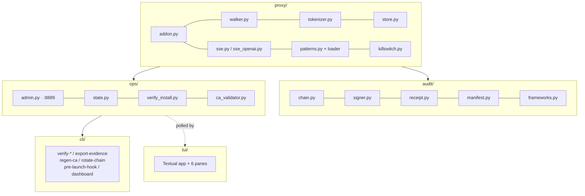
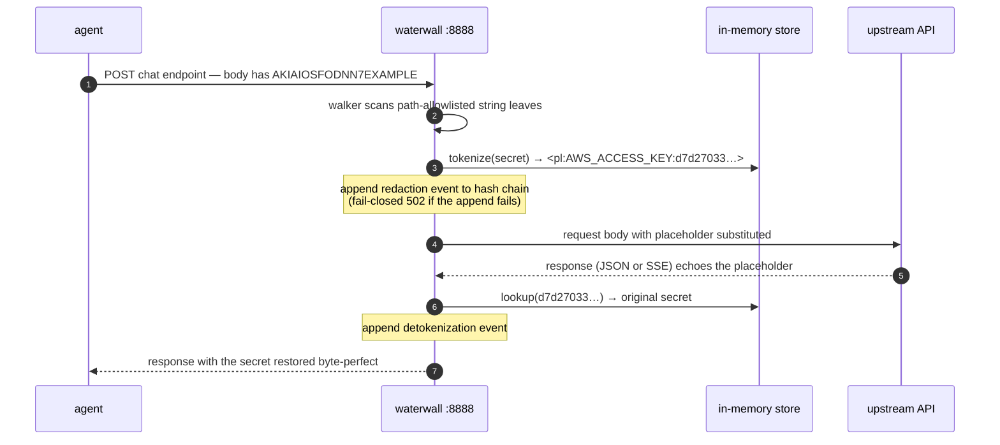
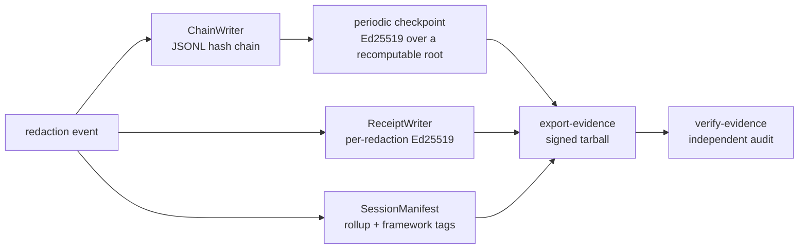

# Architecture

Waterwall is a **mitmproxy addon** listening on `127.0.0.1:8888`, plus a loopback
admin/health server on `127.0.0.1:8889`. It intercepts the chat-completion endpoint of each
permitted upstream host, tokenizes secrets outbound, and restores them inbound.

## Package map

| Package | Responsibility |
|---|---|
| `proxy/` | mitmproxy hooks, the JSON walker, tokenizer, in-memory store, per-host SSE handlers, pattern set + loader, kill switch |
| `audit/` | hash-chain writer, Ed25519 signer, per-redaction receipts, session manifests, compliance framework tags |
| `ops/` | admin + `/healthz` server, runtime/startup `verify-install`, state aggregator, CA validator + generator |
| `cli/` | the `waterwall` command — verify-chain / verify-receipt / verify-evidence / export-evidence / regen-ca / rotate-chain / pre-launch-hook / dashboard |
| `tui/` | the cyberpunk Textual dashboard (read-only, polls the admin server) |

## Outbound flow (egress)

When a request body contains a secret, here is what actually crosses the wire:

1. The **walker** recurses the JSON body and yields only the string leaves on a
   path-allowlist (so it never scans, e.g., model names or role fields).
2. Each leaf is matched against the **pattern set**.
3. Matches are replaced with `<pl:TYPE:HMAC8>` placeholders; the plaintext is held in a
   per-process **store** keyed by the HMAC.
4. The modified body is forwarded upstream.

See the [Redaction Model](redaction.html) for the placeholder format and pattern set.

## Inbound flow (ingress) and streaming

- **Non-streaming JSON:** the walker recurses the response and substitutes any
  `<pl:…>` placeholders back to plaintext.
- **Streaming SSE:** responses are buffered per content block and finalized at end-of-stream,
  then placeholders are restored. Both the Anthropic and OpenAI handlers currently
  **buffer-then-restore** — true per-chunk streaming is a planned enhancement (see the
  [Threat Model](threat-model.html) limitations).

## The audit pipeline

Every redaction emits independently verifiable artifacts:

The chain resumes its sequence and previous-hash across proxy restarts, so legitimate
restarts do not look like tampering. `verify-chain` recomputes each checkpoint root from the
line's own content before checking the signature, so a replayed signature on a forged chain
fails. See the [CLI Reference](cli.html) for the verification commands.

## Fail-closed posture

Waterwall prefers refusing traffic to leaking it. A missing/corrupt host config, a
chain-append failure on either the request or response path, or any of the four kill-switch
sources returns **HTTP 502** rather than forwarding plaintext. The admin endpoints bind
loopback-only and are not user-configurable to bind elsewhere.
