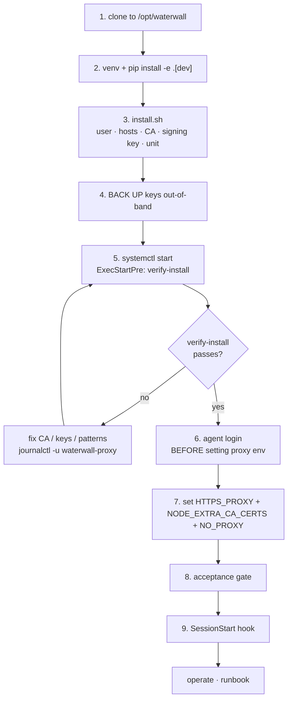

# Deploy

The full production install procedure. For a faster first run, see
[Onboarding & Setup](onboarding.html); for day-to-day operation, see the
[Runbook](runbook.html). Validated on Debian 13; adjacent Debian/Ubuntu releases work
unchanged, other distros may need package-name swaps.

## At a glance



## 1–2. Source and venv

```bash
sudo git clone https://github.com/jimstratus/waterwall.git /opt/waterwall
cd /opt/waterwall
sudo python3 -m venv .venv
sudo .venv/bin/pip install -e ".[dev]"
sudo .venv/bin/python -m pytest 2>&1 | tail -3     # sanity: expect 0 failed
```

The `[dev]` extra pulls in pytest + ruff + mypy; drop it for a slimmer prod install.

## 3. Run the installer

```bash
sudo ./deploy/systemd/install.sh
```

Idempotent. It creates the `waterwall` user, seeds `permitted_hosts.yaml`, generates a
Name-Constrained **RSA-4096** CA and the **Ed25519** signing keypair (only if absent), writes
default `patterns.py` + `config.yaml`, creates the log dirs, installs the systemd unit +
weekly restart timer, and enables (does not start) the service.

```bash
sudo systemctl is-enabled waterwall-proxy.service           # → enabled
ls -la /etc/waterwall/                                       # CA + signing key + hosts present
cat /etc/waterwall/permitted_hosts.yaml
```

## 4. Back up the keys (critical)

Copy out-of-band **before** starting: `signing.key` (lose it and all past audit logs become
unverifiable forever), `signing.pub` (safe to share), and `ca.{pem,key}` (needed to re-issue
clients). See [Onboarding §3](onboarding.html).

## 5. Start

```bash
sudo systemctl start waterwall-proxy.service
ss -tlnp | grep -E '8888|8889'                               # proxy + admin listening
curl -sf http://127.0.0.1:8889/healthz | python3 -m json.tool
```

`ExecStartPre` runs the 10 startup checks before the proxy launches; a failure blocks start
and the unit retries. A healthy probe shows `"status": "ok"`, `"chain_intact": true`, and a
non-zero `"patterns_loaded"`.

## 6–7. Authenticate, then enable the proxy

Log the agent in with the proxy **off**, smoke-test, then export `HTTPS_PROXY`,
`NODE_EXTRA_CA_CERTS`, and the `NO_PROXY` exclusions — full sequence in
[Onboarding §5](onboarding.html). The name-constrained CA refuses to intercept your client's
update/telemetry hosts by design, so those must be in `NO_PROXY`.

## 8. Acceptance gate

```bash
sudo bash /opt/waterwall/tools/verify-deploy.sh
```

Runs every gate end-to-end: `/healthz` 200, `verify-install --runtime` 10/10, a redaction
round-trip, the agent round-trip (a command preserves the placeholder and substitution
restores it), a kill-switch arm/502/disarm cycle, and `verify-chain` on the resulting log.
PASS on all = production-ready.

## 9. SessionStart hook

Add the pre-launch hook to `~/.claude/settings.json` so each session warns when the proxy is
down or kill-switched. SessionStart hooks warn but cannot hard-block; the
`deploy/wrappers/waterwall-launch` wrapper gives a hard refusal-to-launch by gating on the
hook's exit code. See [Onboarding §7](onboarding.html).

## Migrating to a new host

1. Stop and disable the old service.
2. Rsync `/etc/waterwall/` (keep `signing.key` mode `0440 root:waterwall`) and
   `/var/log/waterwall/` (for evidence continuity) to the new host.
3. Install through steps 1–5 — `install.sh` leaves an existing CA / signing key / host list alone.
4. Start and run the acceptance gate.
5. Update each client's `HTTPS_PROXY` if the host's address changed.

The chain log resumes its sequence and previous-hash across hosts, so a copied chain
continues verifiably without a manual rotate. For a deliberate clean break, stop the proxy
and run `waterwall rotate-chain` — it appends a properly-chained terminal entry and archives
the old log so the archive still passes `verify-chain`.

## Decommission

Stop and disable the service, optionally `export-evidence` for archival, securely shred
`signing.key`, remove the units, and clean up `/opt/waterwall`, `/var/log/waterwall`,
`/run/waterwall`, `/etc/waterwall` once you've archived anything you want to keep.

## Troubleshooting

| Symptom | Likely cause | Fix |
|---|---|---|
| `systemctl start` fails immediately | `ExecStartPre` `verify-install` failed (CA mismatch, missing key, bad patterns) | `journalctl -u waterwall-proxy` shows the failing check; often `regen-ca` after editing the host list |
| `/healthz` returns 503 | a health probe failed (signer key, pattern count, chain intact) | `curl -s :8889/healthz \| jq` shows which |
| login fails `permitted subtree violation` | `HTTPS_PROXY` was set during login | `unset HTTPS_PROXY` and retry |
| agent `--print` returns 401 | no cached auth token | log in (without proxy) first |
| TLS handshake fails for a non-API host | that host isn't permitted and isn't in `NO_PROXY` | add it to `NO_PROXY` — the CA is constrained by design |
