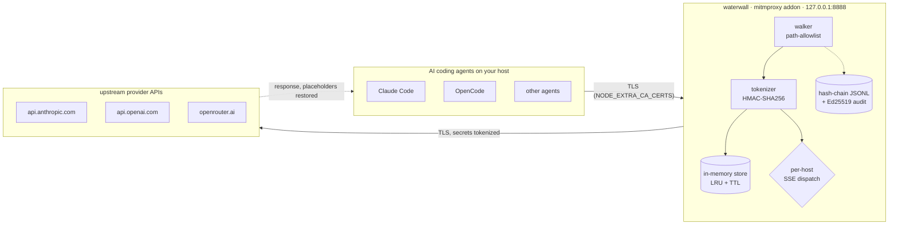

# Waterwall

> **Reversible-tokenization egress proxy for AI coding agents.**
> Your secrets never reach the model provider — and come back byte-for-byte when they return.

Waterwall is a [mitmproxy](https://mitmproxy.org) addon that sits between your AI coding
agents (Claude Code, OpenCode, and others) and the upstream API. On the way **out**, it
replaces secret-shaped strings with deterministic placeholders. On the way **back in**
(including streaming responses) it restores them exactly. The provider only ever sees
`<pl:AWS_ACCESS_KEY:d7d27033…>` — never your real key.

It is built for a **single-operator homelab**: one trusted person running their own proxy
on their own host. It is *not* a multi-tenant SaaS, and it does not pretend to defend
against a root attacker on its own box — see the [Threat Model](threat-model.html).

## What it does, in one diagram



## Why you might want it

- **The provider never sees plaintext secrets.** Keys, tokens, and PEM private keys in a
  request body are tokenized before they leave the host.
- **Round-trips are lossless.** Placeholders are deterministic and reversible, so a
  response that echoes a secret restores to the real value — even across streamed chunks.
- **Everything is auditable.** A tamper-evident, hash-chained log with Ed25519 checkpoints
  records every redaction, and a CLI lets anyone with the public key verify it independently.
- **It fails closed.** A bad config, a chain-append failure, or an armed kill switch returns
  `502` rather than silently forwarding plaintext.

## Quickstart

```bash
# 1. install (Debian-family host shown)
sudo git clone https://github.com/jimstratus/waterwall.git /opt/waterwall
cd /opt/waterwall && sudo python3 -m venv .venv && sudo .venv/bin/pip install -e ".[dev]"
sudo ./deploy/systemd/install.sh        # user, config, CA, signing key, service
sudo systemctl start waterwall-proxy

# 2. point an agent at it (AFTER you've logged the agent in — see Onboarding)
export HTTPS_PROXY=http://127.0.0.1:8888
export NODE_EXTRA_CA_CERTS=/etc/waterwall/ca.pem
```

Full walkthrough: **[Onboarding & Setup](onboarding.html)**. How it works under the hood:
**[Architecture](architecture.html)** and the **[Redaction Model](redaction.html)**.

## Where to go next

| If you want to… | Read |
|---|---|
| Install it and point an agent at it | [Onboarding & Setup](onboarding.html) |
| Understand the moving parts | [Architecture](architecture.html) |
| Know exactly what gets redacted | [Redaction Model](redaction.html) |
| Operate it day-to-day | [Runbook](runbook.html) |
| Verify audit evidence | [CLI Reference](cli.html) |
| See what it does and doesn't defend | [Threat Model](threat-model.html) |
| File a bug or idea | [the issue tracker](https://github.com/jimstratus/waterwall/issues) |

---

*Waterwall is provided as-is under the [MIT License](license.html). You are responsible for
how you deploy and operate it — please read the [Disclaimer](disclaimer.html).*
