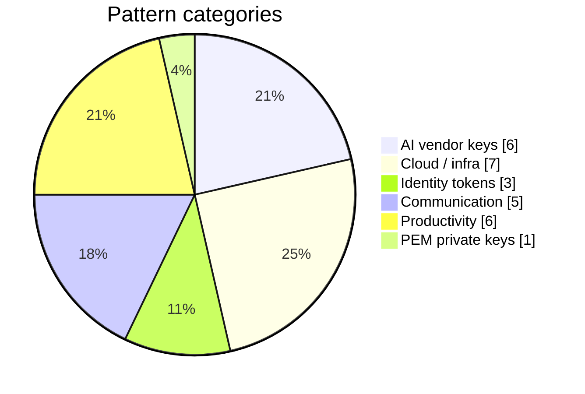

# Redaction Model

Waterwall's core job is **reversible tokenization**: turn a secret into an opaque,
deterministic placeholder on the way out, and turn it back on the way in.

## The placeholder format

```text
<pl:TYPE:HMAC8>
```

- `TYPE` is the matched credential class, e.g. `AWS_ACCESS_KEY`, `ANTHROPIC_KEY`, `GITHUB_TOKEN`.
- `HMAC8` is the first 16 hex characters of `HMAC-SHA256(session_key, plaintext)`.

Because the placeholder is keyed by an **HMAC of the plaintext under a per-process session
key**, it is:

- **Deterministic within a process** — the same secret always maps to the same placeholder,
  so a response that echoes it can be restored, and repeated occurrences stay consistent.
- **Unguessable without the session key** — the provider cannot reverse the placeholder or
  correlate it to a known value.

## What gets scanned: the path-allowlist

The **walker** does not scan the whole request blindly. It recurses the JSON body and yields
only string leaves whose JSON path is on an allowlist (message content and similar
free-text fields), skipping structural fields like model identifiers and roles. This keeps
redaction focused on the places secrets actually appear and avoids corrupting protocol fields.

## The pattern set

Each scanned leaf is matched against a curated regex set covering common credential shapes —
single-line API keys and tokens plus one multi-line PEM block matcher. Representative
categories:



- **AI vendors** — Anthropic (key + OAuth), OpenAI, Google AI, OpenRouter, Groq, Perplexity
- **Cloud / infra** — AWS, Cloudflare, GitHub, Vercel, Supabase, Turso, Dropbox
- **Identity tokens** — Atlassian, HuggingFace, JWT
- **Communication** — Discord, Telegram, SendGrid, Twilio (SID + key)
- **Productivity** — Notion, Linear, ClickUp, Jina, ElevenLabs, Brave Search
- **PEM private keys** — OpenSSH / RSA / EC / DSA / PGP private-key blocks (multi-line)

The live count is reported by `/healthz` as `patterns_loaded`. The set is the **published
policy**: an unfamiliar format is treated as honest data, not a redaction failure — you add
new shapes to `/etc/waterwall/patterns.py` and hot-reload.

!!! note "Hot-reload is audited"
    Editing the pattern file and reloading swaps the live scan set without dropping
    connections and emits a `policy_change` event into the audit chain. A `policy_hash`
    (SHA-256 of the canonical pattern set) is stamped on every redaction line, so the policy
    in force for any redaction is provable after the fact.

## Restoring on the way back

- **JSON responses** — the walker recurses and substitutes placeholders back to plaintext
  from the in-memory store.
- **Streaming (SSE)** — the response is buffered per content block and restored at
  end-of-stream. The OpenAI handler restores correctly across delta-chunk boundaries.

## Known boundaries

Redaction is at the **literal-string level**. A secret that is base64-encoded inside a JSON
string is not matched, and a high-entropy token in an unfamiliar format passes through until
you add a pattern for it. These are documented limitations, covered in the
[Threat Model](threat-model.html), not silent failures — the model is "pattern-set as
published policy."
