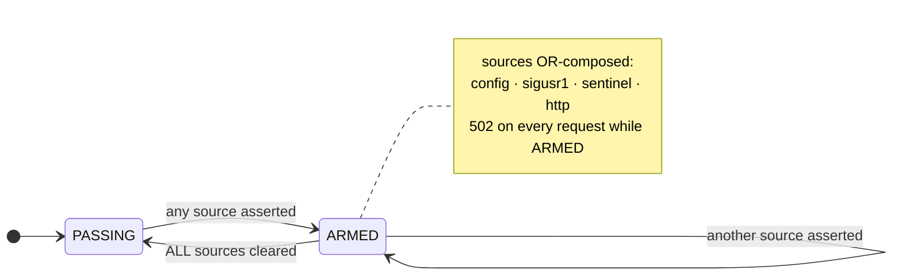

# Runbook

Day-to-day operations, diagnostics, and recovery. Ports: proxy `127.0.0.1:8888`, admin/health
`127.0.0.1:8889`. Service: `waterwall-proxy.service` (runs as the unprivileged `waterwall` user).

!!! note "Getting the `waterwall` CLI on PATH"
    The command is the venv console script and is not on `PATH` by default; `sudo` also uses a
    restricted `secure_path` that excludes the venv. The clean one-time fix (works for your
    user **and** `sudo`):
    ```bash
    sudo ln -s /opt/waterwall/.venv/bin/waterwall /usr/local/bin/waterwall
    ```
    Otherwise substitute the full shim path `/opt/waterwall/bin/waterwall`. Commands touching
    `signing.key` (`0400 root`) or `/var/log/waterwall` (`0750`) need root.

## Kill switch — four OR-composed sources

Any one engaged → fail-closed (HTTP 502 on every request). The check runs **before** the host
gate, so an armed switch blocks every intercepted flow.



| Source | Arm | Persistence |
|---|---|---|
| **config.yaml** | `echo 'kill_switch: true' \| sudo tee /etc/waterwall/config.yaml` | across restart |
| **SIGUSR1** | `sudo kill -USR1 $(pidof waterwall-proxy)` | in-memory latch; resets on restart |
| **Sentinel** | `sudo touch /run/waterwall/kill` | survives restart; cleared on reboot or stop |
| **HTTP API** | `curl -X POST localhost:8889/admin/killswitch -d '{"action":"arm","reason":"..."}'` | in-memory until disarm/restart |

**Disarming one source does not clear the others** — the switch is OR-composed. Clear each
asserted source (config → set `false`; sigusr1 → send again to toggle off; sentinel → `rm`;
http → POST `disarm`), then verify:

```bash
curl -s localhost:8889/admin/state | jq '.killswitch'    # all flags false, active: false
```

## Hot-reload patterns

Edit `/etc/waterwall/patterns.py` (`PATTERNS = [(label, regex), ...]`). The loader picks it up
within ~1 s. A **successful** reload swaps the live scan set, refreshes the policy hash, and
writes a `policy_change` chain line. On a parse/compile error it logs `reload refused: …` and
**keeps the existing set**. Over the admin API the refusal surfaces as HTTP 500, not a false 200:

```bash
curl -i -X POST localhost:8889/admin/reload     # 200 {"status":"reloaded"} or 500 {"error":"..."}
```

## Restart / rotate

```bash
sudo systemctl restart waterwall-proxy.service
```

Restart drops in-flight connections; clients reconnect on the next request. The chain log
**resumes** sequence and previous-hash from the last line — no false tamper alarm, no manual
rotate needed. Rotate only for a clean break or a torn tail (proxy must be stopped):

```bash
sudo systemctl stop waterwall-proxy
sudo waterwall rotate-chain --chain-path /var/log/waterwall/proxy.jsonl
sudo systemctl start waterwall-proxy
```

## Add / change a permitted host

```bash
sudoedit /etc/waterwall/permitted_hosts.yaml      # add {host, sse_handler: anthropic|openai|none}
sudo waterwall regen-ca                            # RSA-4096 CA, permittedSubtrees = new set
# re-import /etc/waterwall/ca.pem on any client that pins NODE_EXTRA_CA_CERTS
sudo systemctl restart waterwall-proxy
```

`regen-ca` generates into a temp dir and swaps only on success (old CA backed up), so a failed
regen leaves the live CA intact.

## Diagnostics

**TUI shows OFFLINE / `/healthz` 503.** `status` is gated by three probes: signer key readable,
pattern count ≥ 16, and `chain_intact`. `upstream_reachable` is reported but does **not** gate
`status` — it stays `false` until the first upstream relay.

```bash
waterwall verify-install --runtime
curl -sf localhost:8889/healthz | jq
sudo journalctl -u waterwall-proxy -n 100
```

**Client stalls minutes after arming the kill switch.** Expected SDK behavior — the proxy
returns 502 immediately but the client backs off on 5xx. Confirm immediacy by bypassing the
retry loop with a direct `curl -x http://127.0.0.1:8888 …`.

**Store at 80%.** Expected for long sessions; the store evicts via LRU + TTL. Investigate only
if it pins at 100% — check `counters_5m.unknown_placeholders`.

## Audit operations

```bash
# verify one receipt
waterwall verify-receipt /var/log/waterwall/receipts/<file>.json --pubkey /etc/waterwall/signing.pub

# verify the whole chain (prev_hash continuity + recomputed checkpoint signatures)
waterwall verify-chain /var/log/waterwall/proxy.jsonl --pubkey /etc/waterwall/signing.pub

# export a signed evidence bundle
waterwall export-evidence \
    --chain /var/log/waterwall/proxy.jsonl \
    --receipts-dir /var/log/waterwall/receipts \
    --manifests-dir /var/log/waterwall/manifests \
    --policy /etc/waterwall/patterns.py \
    --pubkey /etc/waterwall/signing.pub --signing-key /etc/waterwall/signing.key \
    --out /tmp/evidence.tar.gz

# verify a bundle end-to-end
waterwall verify-evidence /tmp/evidence.tar.gz --pubkey /etc/waterwall/signing.pub
```

Reading the chain with `jq`:

```bash
jq -c 'select(.line_type=="redaction") | {seq, host, redactions}' /var/log/waterwall/proxy.jsonl | head
jq -rc 'select(.host) | .host' /var/log/waterwall/proxy.jsonl | sort | uniq -c   # per-host attribution
```

## Backup

| Artifact | Location | Policy |
|---|---|---|
| Signing key | `/etc/waterwall/signing.key` | out-of-band; **lost = all history unverifiable** |
| Public key | `/etc/waterwall/signing.pub` | distribute to verifiers |
| CA cert + key | `/etc/waterwall/ca.{pem,key}` | out-of-band; re-issues clients |
| Permitted hosts | `/etc/waterwall/permitted_hosts.yaml` | back up with the CA (subtrees must match) |
| Chain / receipts / manifests | `/var/log/waterwall/…` | logrotate; ~14-day retention |

## TUI keymap

`[r]` reload patterns · `[k]` killswitch modal · `[v]` verify-install · `[e]` export evidence ·
`[t]` toggle tail · `[q]` quit. Launch always-on in tmux with
`/opt/waterwall/deploy/waterwall-tui`. See the [TUI Dashboard](tui.html) page for the panes.
