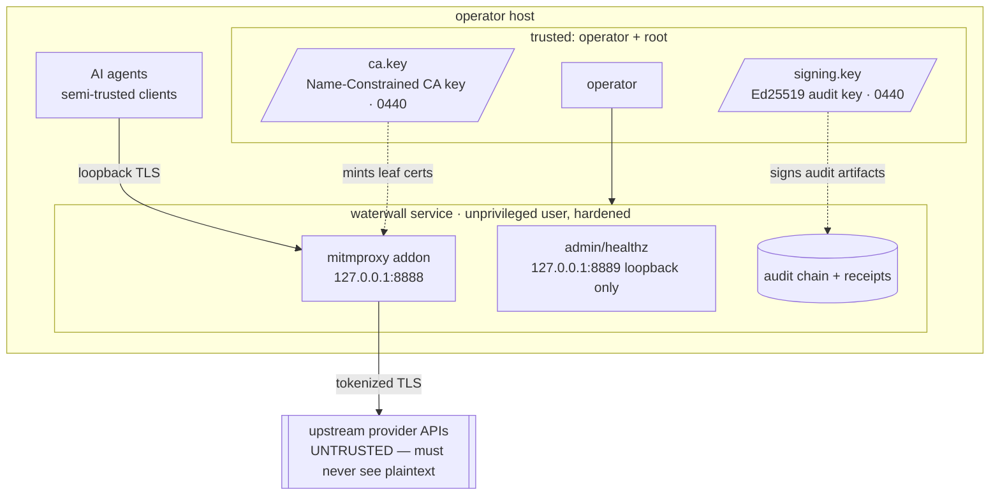

# Threat Model

**Single-operator homelab scope.** Calibrate every "risk" below to a single trusted operator
on their own host — not a hostile-tenant SaaS. Multi-tenant deployment is out of scope and not
addressed by this design.

## Trust boundaries

The single hard boundary Waterwall enforces is **agent → upstream**: plaintext secrets must
not cross it. Everything inside the host is semi-trusted under the single-operator model; the
audit layer makes operator-side tampering *evident*, not *impossible*.

## In scope (mitigated)

| Threat | Mitigation |
|---|---|
| **Plaintext credential leaving the host** | Request bodies walk a JSON path-allowlist; secret-shaped strings become `<pl:TYPE:HMAC8>` placeholders before forwarding, across all permitted hosts via per-host SSE dispatch. |
| **Config error silently disabling redaction** | A missing/unparseable host config is fail-closed: every request returns 502 rather than forwarding plaintext, and the kill-switch check runs before the host gate. |
| **Audit-log tampering** | Hash-chained JSONL: each line carries `prev_hash`. `verify-chain` reports the first seq where continuity breaks. The chain resumes across restarts, so legitimate restarts don't look like tampering. |
| **Forgery via replayed signature** | Periodic Ed25519 checkpoints; `verify-chain` recomputes the root from the line's own content before checking the signature, so a genuine `(root, signature)` replayed onto a fabricated chain fails. |
| **Evidence-bundle tampering / omission** | `export-evidence` signs the MANIFEST; `verify-evidence` checks it, cross-checks chain stats against the actual verify result, and cross-references every receipt to a real redaction line. |
| **Chain-append failure** | Fail-closed on both request and response paths → 502 on the in-flight request; checkpoints fsync. |
| **Mid-flight policy change unnoticed** | A `policy_hash` is stamped on every redaction line; a hot-reload emits a `policy_change` event and a refused reload returns 500 instead of a false success. |
| **Operator panic / runaway errors** | Four-source kill switch (config / SIGUSR1 / sentinel / HTTP), OR-composed, fail-closed. |
| **CA misuse beyond permitted hosts** | The CA is X.509 Name-Constrained (critical `NameConstraints`) to the exact host set; `verify-install` validates it against the live list and rejects an expired CA or non-critical constraints. |
| **Admin-endpoint exposure** | `/healthz` and `/admin/*` bind `127.0.0.1` only; loopback-only is enforced in code, not user-configurable. |
| **Client header steering artifact paths** | Request-id / session-id headers are sanitized before use in receipt/manifest filenames — a `../` value cannot escape the output directory. |
| **systemd privilege escalation** | Hardened unit: `NoNewPrivileges`, `ProtectSystem=strict`, `ProtectHome`, empty `CapabilityBoundingSet`, a `SystemCallFilter`, memory/CPU caps, and read-only config/code paths. |

## Out of scope (not mitigated, by design)

- **Root attacker on the host.** A root user can read the signing key and forge signatures with
  the live key. Waterwall is tamper-**evident**, not tamper-**proof**. A separate signer process
  is a future enhancement.
- **Novel credential formats not in the pattern set.** A new key shape isn't redacted until you
  add it. The model is "pattern-set as published policy" — an unknown format is honest data, not
  a redaction failure.
- **Encoded payloads.** A secret base64-encoded inside a JSON string is not scanned; matching is
  at the literal-string level.
- **Cert-pinning bypass.** A client with baked-in cert pinning bypasses TLS interception
  entirely. Re-verify your client respects `NODE_EXTRA_CA_CERTS` before any upgrade.
- **Upstream package compromise.** Dependencies are trusted; pinned versions are the mitigation.
- **DoS / resource exhaustion.** Memory/CPU caps are blunt instruments; a determined local
  attacker can still saturate the proxy. Out of scope for a single operator.

## Honest limitations

- **Tamper-evidence ≠ non-repudiation** — the signer key lives in the addon process.
- **No entropy fallback** — the pattern set is regex-only; a high-entropy token in an unfamiliar
  format passes through. Operator-tunable entropy gating is a candidate enhancement.
- **SSE is buffer-then-restore, not true per-chunk streaming** — long-running streams block until
  completion. True per-chunk streaming is planned.

## Compliance framework mapping

Every chain line carries a `frameworks` tag list mapping the operation to recognized control
families. Representative tags:

| `line_type` | Framework tags |
|---|---|
| `redaction` | `SOC2-CC7.2`, `SOC2-CC9.2`, `OWASP-LLM-02`, `OWASP-LLM-06`, `EU-AI-Act-Art-12`, `EU-AI-Act-Art-13`, `MITRE-ATLAS-T0048`, `NIST-800-53-AC-4` |
| `detokenization` | `SOC2-CC7.2`, `OWASP-LLM-02` |
| `killswitch` | `SOC2-CC7.3`, `EU-AI-Act-Art-15` |
| `policy_change` | `SOC2-CC8.1` |
| `manifest` | `SOC2-CC4.1`, `EU-AI-Act-Art-12` |

Families: **SOC 2** (monitoring, system ops, change management, risk mitigation), **OWASP-LLM**
(insecure output handling, sensitive-information disclosure), **EU AI Act** (record-keeping,
transparency, accuracy/robustness), **MITRE ATLAS** (sensitive-data exposure), **NIST 800-53**
(information-flow enforcement).
